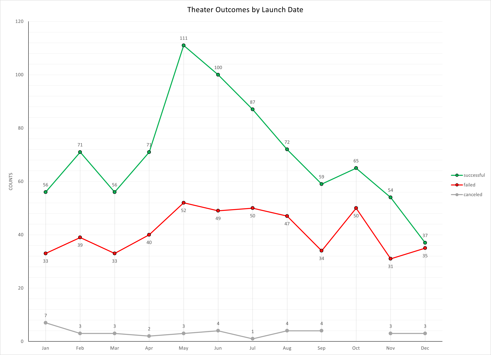
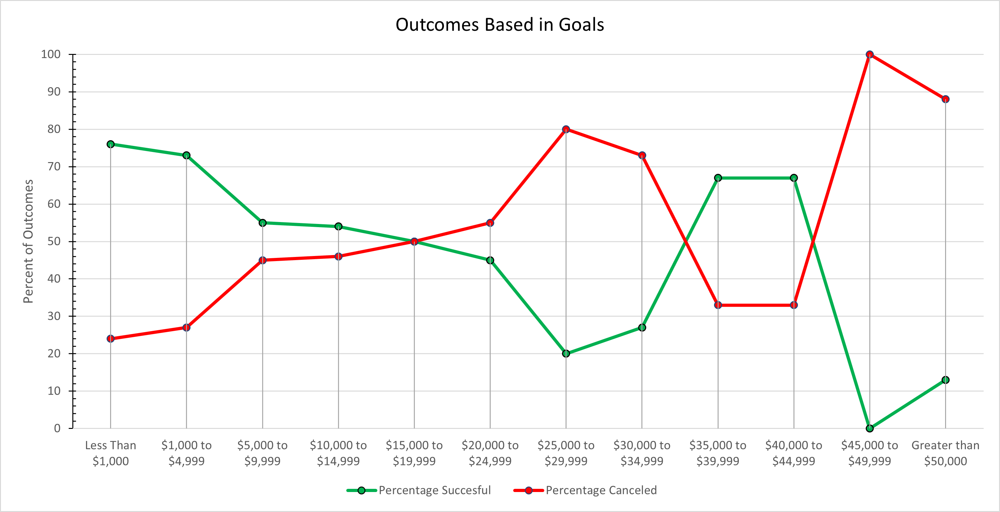
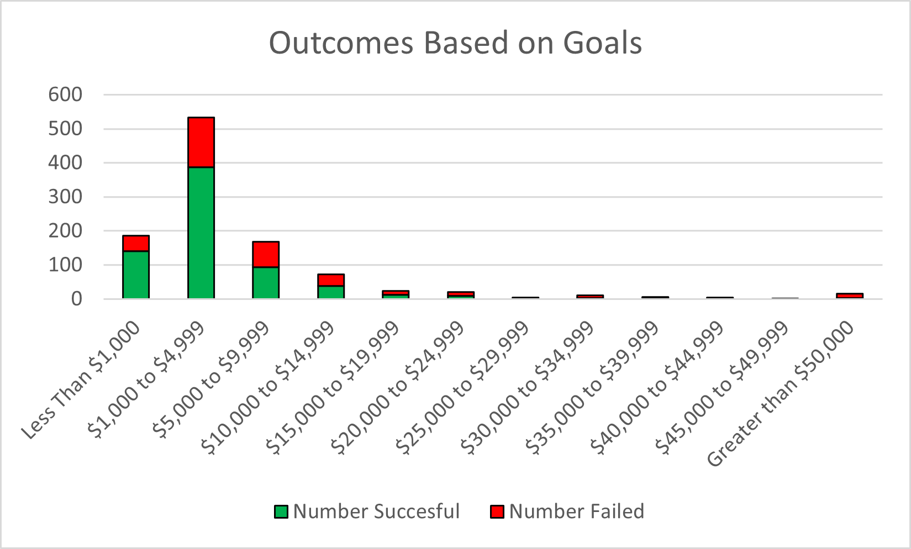
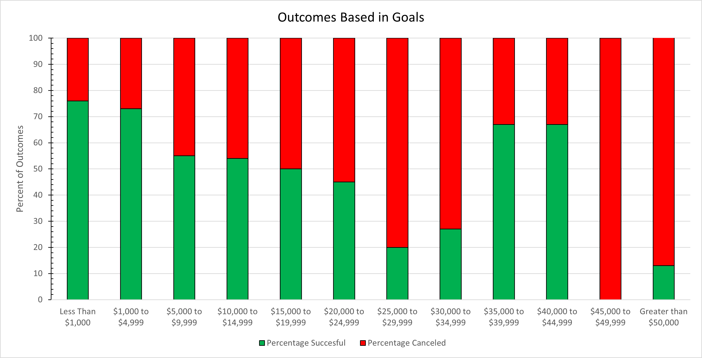

# Kickstarting with Excel

## Overview of Project
The Kickstarter project is intended to make informed recommendations based on available results from crowd funding campaigns to Lousie who desires to initiate a campaign to fund a play. The analysis was conducted using excel. The dataset used in the analysis contains 4113 results from previous campaigns. For each campaign, these data contain information on the date they were initiated, their outcome, the target and pledged amount of donations, the country of origin, and the category of the proposal. Exploratory data analysis was conducted to elicit attributes of these campaigns. Subsets of these data within the category of theater and with characteristics aligned with her campaign such as target goals was conducted for Louise. Informed by these analyses, Louise's campaign was able to accumulate the majority of the fundraising goal.               

### Purpose
In attempt to gain more understanding about the outcomes of related campaigns, Louise has requested further investigation. Using the parent category of theater, an analysis of the outcomes based of the launch dates was conducted. The purpose of this analysis is to reveal insight into the times of year which the most successful outcomes occurred. In addition to investigation of outcomes based on the launch date, analysis of the outcomes based on the fundraising goal was conducted. The purpose of this analysis is to use the subcategory of "plays" to determine if the amount of the fundraising goal influenced to the outcome of these campaigns.

## Analysis and Challenges

### Analysis of Outcomes Based on Launch Date
The analysis based on the outcomes from the launch date was generated by extracting the year from the launch date. This was done using ```=YEAR(S2)``` where the cell S2 was the date formatted from the UNIX timestamp using ```=(((L2/60)/60)/24)+DATE(1970,1,1)``` where the cell L2 was the UNIX timestamp. After adding the year column, a pivot table was generated (Table 1). The pivot table filters for the year of the launch and the parent category. Populating the rows are the counts of the outcomes based on the month that they were initiated. Using these data, a line chart was generated to visualize the outcomes over time (Figure 1). This was done by inserting a line chart within excel. 

**Table 1. Pivot table of kickstarter data filtered by the parent category of theater.**
| **Year Created**  | **(All)**     |        |          |             |
|:-----------------:|:-------------:|:------:|:--------:|:-----------:|
| **Parent Category**| **theater**  |        |          |             |
|                   |               |        |          |             |
| **Month**         | **successful**| **failed** | **canceled** | **Grand Total**|
| Jan               | 56            | 33     | 7        | 96          |
| Feb               | 71            | 39     | 3        | 113         |
| Mar               | 56            | 33     | 3        | 92          |
| Apr               | 71            | 40     | 2        | 113         |
| May               | 111           | 52     | 3        | 166         |
| Jun               | 100           | 49     | 4        | 153         |
| Jul               | 87            | 50     | 1        | 138         |
| Aug               | 72            | 47     | 4        | 123         |
| Sep               | 59            | 34     | 4        | 97          |
| Oct               | 65            | 50     | 0        | 115         |
| Nov               | 54            | 31     | 3        | 88          |
| Dec               | 37            | 35     | 3        | 75          |
| **Grand Total**   | **839**       | **493**| **37**   | **1369**    |

**Figure 1. Line plot of the theater outcomes by launch date**


### Analysis of Outcomes Based on Goals

An analysis based on the outcomes from different goal amounts was conducted. To do this, an additional sheet was used and table created with ranges of goal amounts (Table 2). To generate this table, the `COUNTIFS()` function was used. The `COUNTIFS()` function was used to count the occurrences of campaigns that met a specific criteria. For example, to get the number of successful campaigns that had a goal that was less than $1000, the following parameters were used: `=COUNTIFS(Kickstarter!$R:$R,"plays",Kickstarter!$G:$G,"successful",Kickstarter!$E:$E, "<1000")`. This function counted the occurrences of plays (column R) that were successful (column G) and had goals less than $1000 (column E). The amount and outcome was then changed in each of the subsequent uses to populate the remaining cells. A percentage of the total campaigns was found using the `SUM()` function. To visualize these data, another line chart was produced (Figure 2).

**Table 2. Outcomes based on the amount of the goal**
| **Goal**               | **Number Successful** | **Number Failed** | **Number Canceled** | **Total Projects** | **Percentage Successful** | **Percentage Failed** | **Percentage Canceled** |
|:----------------------:|:--------------------:|:-----------------:|:-------------------:|:------------------:|:------------------------:|:---------------------:|:-----------------------:|
| "Less Than $1,000"     | 141                  | 45                | 0                   | 186                | 76                       | 24                    | 0                       |
| "$1,000 to $4,999"     | 387                  | 146               | 0                   | 533                | 73                       | 27                    | 0                       |
| "$5,000 to $9,999"     | 93                   | 76                | 0                   | 169                | 55                       | 45                    | 0                       |
| "$10,000 to $14,999"   | 39                   | 33                | 0                   | 72                 | 54                       | 46                    | 0                       |
| "$15,000 to $19,999"   | 12                   | 12                | 0                   | 24                 | 50                       | 50                    | 0                       |
| "$20,000 to $24,999"   | 9                    | 11                | 0                   | 20                 | 45                       | 55                    | 0                       |
| "$25,000 to $29,999"   | 1                    | 4                 | 0                   | 5                  | 20                       | 80                    | 0                       |
| "$30,000 to $34,999"   | 3                    | 8                 | 0                   | 11                 | 27                       | 73                    | 0                       |
| "$35,000 to $39,999"   | 4                    | 2                 | 0                   | 6                  | 67                       | 33                    | 0                       |
| "$40,000 to $44,999"   | 2                    | 1                 | 0                   | 3                  | 67                       | 33                    | 0                       |
| "$45,000 to $49,999"   | 0                    | 1                 | 0                   | 1                  | 0                        | 100                   | 0                       |
| "Greater than $50,000" | 2                    | 14                | 0                   | 16                 | 13                       | 88                    | 0                       |

**Figure 2. Line chart of the outcomes based on the amount of the goal.**



### Challenges and Difficulties Encountered
Personal challenges that arose during this analysis pertained to the overall aesthetic of the line plots. Customizing the appearance to best visualize the data took time navigating the plot settings and finding the correct window to manipulate the plot features. Unintendedly, I was initially attempting to use the function `COUNTIF()` instead of the `COUNTIFS()` function. I could not get this working for quite some time until I realized that I was using the wrong function (I was missing that "S"). Once this error was realized, ease of use followed. Other possible challenges that one could be faced during this analysis is within the conversion of the UNIX timestamp. It is not immediately obvious to some who may be unfamiliar with the timestamp and it is not straightforward how to convert from seconds passed since January 1st, 1970 to the format of mm/dd/yyyy. 

## Results

- What are two conclusions you can draw about the Outcomes based on Launch Date?

The most success is realized by campaigns which were initiated in the months of May, June and July. The most successful month of the year is May with diminishing success in subsequent months. The least successful month is December, with almost the same number of successful campaigns as failed ones. One was to evaluate which months yield the most successful outcomes, one could take the difference between the successful and the failed number of outcomes. The months with the greatest difference in outcomes would be the most probable months of achieving a successful proposal. Following this approach, the month of May has the greatest difference while the months of October and December would give the lowest probability of success.

- What can you conclude about the Outcomes based on Goals?

The outcomes based on the amount of the goal are most successful when the goal is less than $5,000. Around 75% of these proposals were successful. Campaign goals between $5,000 to $25,000 show an essentially equal probability of success or failure. The least successful goal amounts are $25,000 to $35,000 and those with goals greater than $45,000. Oddly, it would seem that the campaigns with goals of $35,000 to $45,000 show higher success rates, but the total amount of these proposals is miniscule, and it would be difficult to base probability of success on this small sample size.

- What are some limitations of this dataset?
One limitation of the dataset is the lack of available information on the donations. For example, whether multiple smaller donations or one large donation is not known. I think that this would be a useful metric to see in order to rule out a successful campaign because the contributions of one benefactor. The only extractable information is the average donation based on the number of backers. 

- What are some other possible tables and/or graphs that we could create?

One additional plot that would be useful is a stacked percentage bar plot based on the goal value ranges (Figure 3). This chart would illustrate the overall number of campaigns within a given goal range and the percentage of them that were successful. If the probability of success was high along with the total number of campaigns within that range, then would could confidently assert a higher probability of success. This would prevent from any recommendations based on the success of only a few campaigns from influencing decisions. Another additional plot that I find more useful than the line plot with the binned goal amounts would be a simple percentage bar chart (Figure 4). A black line marked at 50% in the chart was used to easily see how close each goal range was to being split evenly in their results, yeilding near-equal chance of success or failure given that goal amount. The line plot implies continuity between bins and I personally find it harder to interpret. The percentage bar plot is easier to see which bars have a higher successful percentage and recomendations can more more readily attained.

**Figure 3.**


**Figure 4. Percentage bar chart of outcomes based on goal amount ranges**



